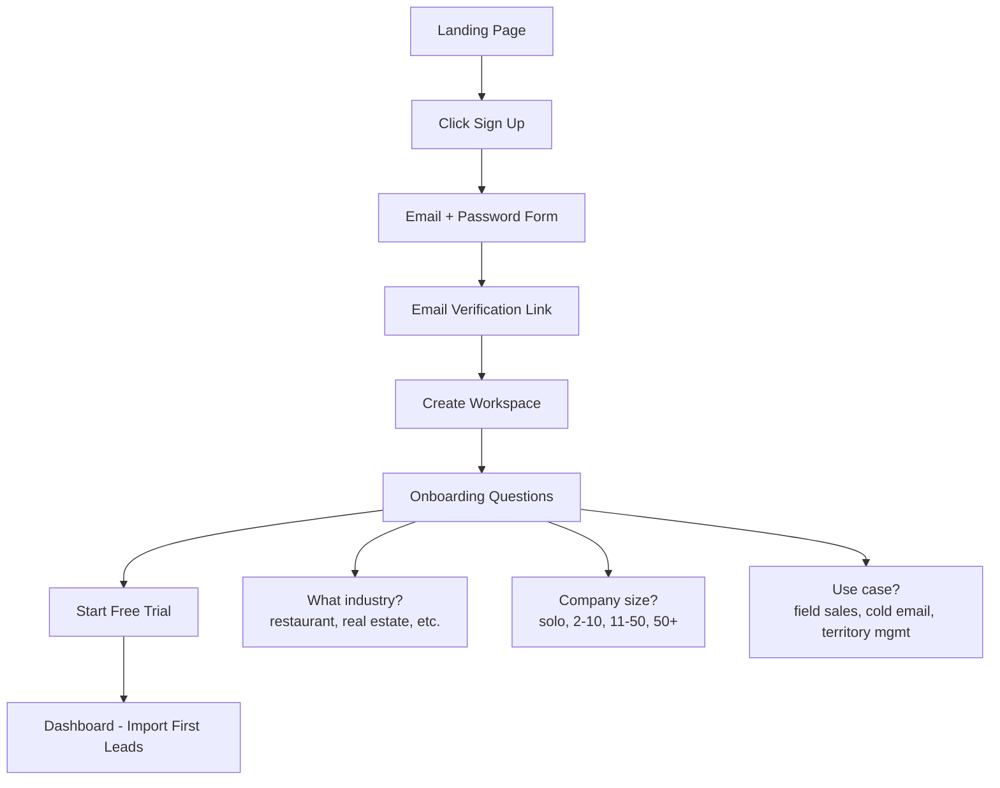

# SaaS Requirements

> Converting B2B Lead Generation CRM to Multi-Tenant SaaS
> Date: 2026-07-13

---

## Executive Summary

**Business Model:** B2B SaaS with freemium + 3 paid tiers  
**Target Market:** Indonesia/SEA (starting), then global expansion  
**Pricing:** IDR + USD (Midtrans + Stripe)  
**Go-to-Market:** Self-service sign-up + free trial (50 leads, no credit card)

---

## SaaS Architecture Overview

### Multi-Tenancy Model

**Strategy:** Shared database with `workspace_id` isolation (already in schema)

```
┌─────────────────────────────────────────────────┐
│         Single PostgreSQL Database              │
│                                                 │
│  ┌──────────────────────────────────────────┐  │
│  │  Workspace A (Startup agency)            │  │
│  │  - 150 leads (Starter plan)              │  │
│  │  - 2 users                               │  │
│  │  - Usage: 15/25 monthly scraping quota  │  │
│  └──────────────────────────────────────────┘  │
│                                                 │
│  ┌──────────────────────────────────────────┐  │
│  │  Workspace B (Real estate company)       │  │
│  │  - 650 leads (Pro plan)                  │  │
│  │  - 5 users                               │  │
│  │  - Usage: 78/100 monthly scraping quota │  │
│  └──────────────────────────────────────────┘  │
│                                                 │
│  ┌──────────────────────────────────────────┐  │
│  │  Workspace C (Enterprise consulting)     │  │
│  │  - 1800 leads (Business plan)            │  │
│  │  - 12 users                              │  │
│  │  - Usage: 156/200 monthly quota          │  │
│  └──────────────────────────────────────────┘  │
└─────────────────────────────────────────────────┘

ALL queries filtered by workspace_id (Row-Level Security)
```

**Benefits:**
- Simpler ops (single DB to backup/maintain)
- Cost-efficient (shared resources)
- Easy to scale initially

**Risks:**
- Noisy neighbor problem (one tenant slows others)
- Data isolation requires perfect query filters
- Harder to move large tenants to dedicated DB later

**Mitigation:**
- Add `workspace_id` index on ALL tables
- Use Drizzle query middleware to auto-inject workspace filter
- Set up connection pooling (PgBouncer)
- Monitor per-workspace query performance

---

## Pricing & Plans

### Pricing Table (aligned with CONTEXT.md + competitive analysis)

| Plan | Monthly Price | Leads Cap | Fresh Leads/mo | AI Reviews/lead | Users | Territories |
|------|--------------|-----------|----------------|-----------------|-------|-------------|
| **Free** | $0 / IDR 0 | 50 | 15 | 5 | 1 | 0 |
| **Starter** | $15 / IDR 220k | 200 | 25 | 10 | 2 | 1 |
| **Pro** | $49 / IDR 720k | 800 | 100 | 20 | 5 | 3 |
| **Business** | $149 / IDR 2.2M | 2,000 | 200 | 40 | 15 | Unlimited |

**Free Trial:**
- 50 leads (no credit card required)
- 7 days full Pro access → then downgrade to Free
- Upgrade prompt when hitting limits

**Annual Discount:**
- 20% off (2 months free)
- Pay IDR 2.1M upfront → get Starter for year

**Add-ons (future):**
- Extra leads: $0.10/lead
- Extra users: $10/user/mo
- WhatsApp enrichment: $0.05/lead
- Dedicated support: $200/mo

---

## Core SaaS Features to Build

### 1. Authentication & Onboarding

#### Sign Up Flow



**Implementation:**
- Supabase Auth (email/password + magic link)
- `/onboarding` flow (3-step wizard)
- Auto-create workspace on signup
- Set trial expiry: `workspace.trial_ends_at = now() + 7 days`

**Database additions:**
```typescript
// packages/db/src/schema/workspaces.ts
export const workspaces = pgTable('workspaces', {
  id: uuid('id').defaultRandom().primaryKey(),
  name: text('name').notNull(),
  slug: text('slug').notNull().unique(), // for subdomain: acme.yourdomain.com
  
  // Billing
  plan: text('plan').default('free'), // free | starter | pro | business
  stripeCustomerId: text('stripe_customer_id'),
  stripeSubscriptionId: text('stripe_subscription_id'),
  subscriptionStatus: text('subscription_status'), // active | canceled | past_due
  trialEndsAt: timestamp('trial_ends_at'),
  
  // Usage tracking
  leadsCount: integer('leads_count').default(0),
  monthlyScrapingQuota: integer('monthly_scraping_quota').default(15),
  monthlyScrapingUsed: integer('monthly_scraping_used').default(0),
  quotaResetsAt: timestamp('quota_resets_at'), // First of next month
  
  // Onboarding
  onboardingCompleted: boolean('onboarding_completed').default(false),
  industry: text('industry'), // restaurant, real-estate, consulting, etc.
  companySize: text('company_size'), // solo, 2-10, 11-50, 50+
  useCase: text('use_case'), // field-sales, cold-email, territory-management
  
  createdAt: timestamp('created_at').defaultNow(),
  updatedAt: timestamp('updated_at').defaultNow(),
});
```

#### Multi-Factor Authentication (Phase 2)
- TOTP (Google Authenticator)
- SMS verification (Twilio for Indonesia numbers)
- Backup codes

---

### 2. Subscription & Billing

#### Stripe Integration (International)

**Flow:**
```typescript
// User clicks "Upgrade to Pro"
1. Create Stripe Checkout Session
2. Redirect to Stripe hosted page
3. User enters card → Stripe processes
4. Webhook: checkout.session.completed
5. Update workspace.plan = 'pro'
6. Update workspace.stripe_subscription_id
7. Redirect to dashboard with success toast
```

**Implementation:**
```typescript
// apps/api/src/billing/billing.service.ts
import Stripe from 'stripe';

@Injectable()
export class BillingService {
  private stripe: Stripe;

  constructor() {
    this.stripe = new Stripe(process.env.STRIPE_SECRET_KEY);
  }

  async createCheckoutSession(workspaceId: string, plan: 'starter' | 'pro' | 'business') {
    const priceId = this.getPriceId(plan); // Price IDs from Stripe dashboard

    const session = await this.stripe.checkout.sessions.create({
      mode: 'subscription',
      payment_method_types: ['card'],
      line_items: [{ price: priceId, quantity: 1 }],
      success_url: `${process.env.APP_URL}/dashboard?success=true`,
      cancel_url: `${process.env.APP_URL}/pricing`,
      client_reference_id: workspaceId,
      metadata: { workspaceId, plan },
    });

    return session.url;
  }

  async handleWebhook(event: Stripe.Event) {
    switch (event.type) {
      case 'checkout.session.completed':
        await this.activateSubscription(event.data.object);
        break;
      case 'invoice.payment_succeeded':
        await this.renewSubscription(event.data.object);
        break;
      case 'customer.subscription.deleted':
        await this.cancelSubscription(event.data.object);
        break;
    }
  }

  private async activateSubscription(session: Stripe.Checkout.Session) {
    const workspaceId = session.client_reference_id;
    const plan = session.metadata.plan;

    await db.update(workspaces)
      .set({
        plan,
        subscriptionStatus: 'active',
        stripeCustomerId: session.customer as string,
        stripeSubscriptionId: session.subscription as string,
      })
      .where(eq(workspaces.id, workspaceId));
  }
}
```

**Stripe Products to Create:**
```bash
# In Stripe Dashboard → Products
1. "Starter Plan" → $15/mo → price_xxxSTARTER
2. "Pro Plan" → $49/mo → price_xxxPRO
3. "Business Plan" → $149/mo → price_xxxBUSINESS
```

#### Midtrans Integration (Indonesia)

**Why:** Most Indonesian SMBs don't have credit cards. Midtrans supports:
- Bank transfer (BCA, Mandiri, BNI, BRI)
- GoPay, OVO, Dana (e-wallets)
- QRIS (scan to pay)
- Indomaret/Alfamart (cash payment at store)

**Flow:**
```typescript
// User clicks "Upgrade to Pro"
1. Create Midtrans Snap transaction
2. Redirect to Midtrans hosted page (choose payment method)
3. User pays via bank transfer / e-wallet
4. Webhook: transaction.success
5. Update workspace.plan = 'pro'
6. Send email: "Payment confirmed, plan upgraded!"
```

**Implementation:**
```typescript
// apps/api/src/billing/midtrans.service.ts
import { Midtrans } from 'midtrans-client';

@Injectable()
export class MidtransService {
  private snap: any;

  constructor() {
    this.snap = new Midtrans.Snap({
      isProduction: process.env.NODE_ENV === 'production',
      serverKey: process.env.MIDTRANS_SERVER_KEY,
    });
  }

  async createTransaction(workspaceId: string, plan: string) {
    const amount = this.getPlanPrice(plan); // 220000 for Starter

    const transaction = await this.snap.createTransaction({
      transaction_details: {
        order_id: `SUB-${workspaceId}-${Date.now()}`,
        gross_amount: amount,
      },
      customer_details: {
        email: workspace.ownerEmail,
        first_name: workspace.name,
      },
      item_details: [
        {
          id: plan,
          price: amount,
          quantity: 1,
          name: `${plan} Plan - 1 Month`,
        },
      ],
      callbacks: {
        finish: `${process.env.APP_URL}/dashboard?payment=success`,
      },
    });

    return transaction.redirect_url;
  }

  async handleWebhook(notification: any) {
    const statusResponse = await this.snap.transaction.notification(notification);
    
    if (statusResponse.transaction_status === 'settlement') {
      const orderId = statusResponse.order_id;
      const workspaceId = orderId.split('-')[1];
      
      await this.activateSubscription(workspaceId, statusResponse.metadata.plan);
    }
  }
}
```

---

### 3. Usage Tracking & Enforcement

#### Lead Count Tracking

**Trigger:** After each scraping job completes
```typescript
// apps/workers/src/processors/scrape.processor.ts
async process(job: Job) {
  const results = await this.pythonScraperService.scrape(job.data);
  
  // Save leads
  for (const business of results) {
    await this.leadsService.create(business);
  }
  
  // Update workspace lead count
  await db.update(workspaces)
    .set({
      leadsCount: sql`leads_count + ${results.length}`,
      updatedAt: new Date(),
    })
    .where(eq(workspaces.id, job.data.workspaceId));
  
  // Check if over limit
  const workspace = await this.workspacesService.findOne(job.data.workspaceId);
  const limit = this.getLeadLimit(workspace.plan); // 50, 200, 800, 2000
  
  if (workspace.leadsCount >= limit) {
    throw new Error(`Lead limit reached (${limit}). Upgrade plan to add more.`);
  }
}
```

#### Monthly Scraping Quota

**Reset on first of each month:**
```typescript
// apps/api/src/jobs/jobs.controller.ts
@Post('scrape')
async createScrapeJob(@Body() dto: CreateScrapeJobDto) {
  const workspace = await this.workspacesService.findOne(dto.workspaceId);
  
  // Check quota
  if (workspace.monthlyScrapingUsed >= workspace.monthlyScrapingQuota) {
    throw new ForbiddenException(
      `Monthly scraping quota exceeded (${workspace.monthlyScrapingQuota}). Resets on ${workspace.quotaResetsAt}.`
    );
  }
  
  // Increment usage
  await db.update(workspaces)
    .set({
      monthlyScrapingUsed: sql`monthly_scraping_used + 1`,
    })
    .where(eq(workspaces.id, dto.workspaceId));
  
  // Create job
  return this.jobsService.create(dto);
}
```

**Cron job to reset quota:**
```typescript
// apps/workers/src/cron/reset-monthly-quota.ts
import { CronJob } from 'cron';

// Run at 00:00 on the 1st of every month
export const resetQuotaJob = new CronJob('0 0 1 * *', async () => {
  await db.update(workspaces).set({
    monthlyScrapingUsed: 0,
    quotaResetsAt: sql`date_trunc('month', now() + interval '1 month')`,
  });
  
  console.log('Monthly scraping quotas reset for all workspaces');
});
```

---

### 4. Workspace Management

#### Team Invites

**Flow:**
```typescript
// Owner clicks "Invite Team Member"
1. POST /api/workspaces/:id/invites
   { email: 'sales@company.com', role: 'rep' }
2. Create invitation record (pending)
3. Send email with magic link
4. User clicks link → auto-creates account + joins workspace
5. Invitation status → accepted
```

**Database:**
```typescript
// packages/db/src/schema/workspace_invitations.ts
export const workspaceInvitations = pgTable('workspace_invitations', {
  id: uuid('id').defaultRandom().primaryKey(),
  workspaceId: uuid('workspace_id').references(() => workspaces.id).notNull(),
  email: text('email').notNull(),
  role: text('role').notNull(), // owner | manager | rep
  token: text('token').notNull().unique(), // Random UUID for magic link
  status: text('status').default('pending'), // pending | accepted | expired
  invitedBy: uuid('invited_by').references(() => users.id),
  expiresAt: timestamp('expires_at').notNull(), // 7 days from creation
  createdAt: timestamp('created_at').defaultNow(),
});
```

#### User Roles & Permissions

```typescript
export enum Role {
  OWNER = 'owner',     // Full access, billing, delete workspace
  MANAGER = 'manager', // Manage leads, view reports, invite reps
  REP = 'rep',         // View/edit assigned leads only, no settings
}

// Middleware to check permission
@Injectable()
export class WorkspaceGuard implements CanActivate {
  canActivate(context: ExecutionContext): boolean {
    const request = context.switchToHttp().getRequest();
    const user = request.user;
    const workspaceId = request.params.workspaceId;
    
    // Check if user belongs to workspace
    const membership = user.workspaceMemberships.find(
      m => m.workspaceId === workspaceId
    );
    
    if (!membership) {
      throw new ForbiddenException('Not a member of this workspace');
    }
    
    // Store in request for controllers to use
    request.workspace = membership;
    return true;
  }
}

// Usage in controller
@Get('leads')
@UseGuards(WorkspaceGuard)
async getLeads(@Request() req) {
  const workspaceId = req.workspace.workspaceId;
  const role = req.workspace.role;
  
  // If rep, only show assigned leads
  if (role === Role.REP) {
    return this.leadsService.findByAssignedUser(req.user.id);
  }
  
  // Manager/owner sees all leads in workspace
  return this.leadsService.findAll(workspaceId);
}
```

---

### 5. Marketing Website & Pricing Page

#### Landing Page (`apps/web/app/(marketing)/page.tsx`)

**Sections:**
1. **Hero:** "Find, Map, and Close B2B Leads Faster"
   - CTA: "Start Free Trial" (50 leads, no credit card)
   - Screenshot of map view + lead table

2. **Features:**
   - 🗺️ Map-First CRM (differentiation!)
   - 🤖 AI-Powered Lead Enrichment
   - 🚀 Bulk Business Finder (scrape 1000s)
   - 📊 Visual Pipeline Management

3. **How It Works:** (3 steps)
   - Step 1: Search businesses by location + category
   - Step 2: View leads on map, filter by rating
   - Step 3: Manage pipeline, assign to reps, close deals

4. **Pricing Table:** (from SAAS-REQUIREMENTS.md)

5. **Testimonials:** (Phase 2 - after first customers)

6. **FAQ:**
   - "How is data scraped?" → Google Maps public data
   - "Is this GDPR compliant?" → Public business info only
   - "Can I export leads?" → Yes, CSV export anytime

7. **CTA Footer:** "Join 100+ businesses finding leads faster"

**Tech Stack:**
- Next.js 15 App Router (already using)
- Tailwind v4 (already using)
- Framer Motion for animations
- `next-intl` for i18n (Bahasa + English)

#### Pricing Page (`apps/web/app/(marketing)/pricing/page.tsx`)

```tsx
export default function PricingPage() {
  return (
    <div className="py-24">
      <h1 className="text-4xl font-bold text-center">
        Simple, Transparent Pricing
      </h1>
      <p className="text-center text-muted-foreground mt-4">
        Start free. Upgrade when you're ready.
      </p>
      
      <div className="grid grid-cols-4 gap-6 mt-12 max-w-7xl mx-auto">
        <PricingCard
          name="Free"
          price="$0"
          features={[
            '50 leads',
            '15 fresh leads/month',
            '1 user',
            'Basic AI insights',
          ]}
          cta="Start Free"
          ctaLink="/signup"
        />
        
        <PricingCard
          name="Starter"
          price="$15"
          priceIdr="IDR 220k"
          features={[
            '200 leads',
            '25 fresh leads/month',
            '2 users',
            '10 reviews per lead',
            '1 territory',
          ]}
          cta="Start Trial"
          ctaLink="/signup?plan=starter"
          highlighted
        />
        
        {/* Pro, Business cards... */}
      </div>
    </div>
  );
}
```

---

### 6. Admin Dashboard (Internal Use)

**Purpose:** Monitor SaaS health, manage users, view revenue

**Features:**
- Total workspaces (active, trial, canceled)
- MRR (Monthly Recurring Revenue)
- Churn rate
- Most active workspaces (by lead count, scraping usage)
- Recent signups
- Failed payment alerts

**Route:** `/admin` (protected, only accessible by superadmin)

**Implementation:** (Phase 2 - after first paying customers)

---

## SaaS Tech Stack Additions

```json
{
  "dependencies": {
    // Billing
    "stripe": "^14.0.0",
    "midtrans-client": "^1.3.1",
    
    // Auth (already planned)
    "@supabase/supabase-js": "^2.39.0",
    "@supabase/ssr": "^0.1.0",
    
    // Email
    "resend": "^3.0.0",              // Transactional emails (invite, receipt)
    "@react-email/components": "^0.0.14", // Email templates
    
    // Marketing
    "framer-motion": "^10.18.0",     // Landing page animations
    "next-intl": "^3.4.0",           // i18n (Bahasa + English)
    
    // Analytics (optional)
    "@vercel/analytics": "^1.1.1",   // If deploying on Vercel
    "posthog-js": "^1.99.0",         // Product analytics
  }
}
```

---

## Implementation Timeline (Updated)

### Phase 1: SaaS Foundation (Week 1-2)

**Week 1:**
- [ ] Auth flow (Supabase signup, login, email verification)
- [ ] Workspace creation on signup
- [ ] Onboarding wizard (3 steps)
- [ ] Landing page (hero, features, pricing)
- [ ] Pricing page (4 tiers, CTA buttons)

**Week 2:**
- [ ] Stripe integration (checkout session, webhooks)
- [ ] Midtrans integration (Snap API, webhooks)
- [ ] Usage tracking (lead count, monthly quota)
- [ ] Plan enforcement (block scraping if over limit)
- [ ] Upgrade flow (free → starter/pro/business)

### Phase 2: CRM Core (Week 3-4)

**Week 3:**
- [ ] Dashboard layout (sidebar, top bar, workspace switcher)
- [ ] Leads table view (TanStack Table + filters)
- [ ] Lead detail panel (slide-over)
- [ ] Kanban pipeline (drag-drop stages)

**Week 4:**
- [ ] Scraping job page (create job, view progress)
- [ ] Map view (MapLibre + clustering)
- [ ] AI enrichment (connect to existing agents)
- [ ] Team invites (send invite, accept flow)

### Phase 3: Go-to-Market (Week 5)

- [ ] Email templates (welcome, invite, payment receipt)
- [ ] Terms of Service + Privacy Policy pages
- [ ] Help/FAQ page
- [ ] Beta launch (invite 10 early adopters)
- [ ] Analytics setup (PostHog events)

**Total:** 5 weeks to SaaS MVP (vs 3 weeks for internal tool)

---

## Pricing Strategy

### For Indonesia Market

**Starter:** IDR 220k/mo (~$15)
- Affordable for freelancers, small studios
- Cheaper than hiring a VA to scrape leads manually

**Pro:** IDR 720k/mo (~$49)
- Target: Small agencies (5-10 people)
- ROI: 1 closed deal/month pays for itself

**Business:** IDR 2.2M/mo (~$149)
- Target: Mid-size companies, franchises
- Value prop: Territory management for field sales teams

### Monetization Levers

1. **Lead storage:** Charge for leads over cap (e.g., $0.10/extra lead)
2. **Add-on features:**
   - WhatsApp enrichment: +$20/mo
   - Advanced routing: +$30/mo
   - White-label: +$200/mo

3. **Enterprise plan:** (Phase 2)
   - Custom pricing ($500+/mo)
   - Dedicated support
   - SSO (SAML/OIDC)
   - SLA guarantee

---

## Go-to-Market Strategy

### Initial Launch (Soft Launch)

1. **Beta waitlist** (2 weeks before launch)
   - Landing page with "Join Waitlist" form
   - Collect 100+ emails

2. **Private beta** (50 users)
   - Invite via email (personal onboarding call)
   - Free Pro plan for 3 months (in exchange for feedback)
   - Fix bugs, improve UX based on feedback

3. **Public launch**
   - Announce on Twitter, LinkedIn, Reddit (r/sales, r/startups)
   - Product Hunt launch (aim for #1 product of the day)
   - Post in Indonesia startup communities (Startup Lokal, Tech in Asia)

### Growth Channels

1. **SEO** (long-term)
   - Blog: "How to find restaurant leads in Jakarta"
   - Tutorial: "Scrape Google Maps for real estate leads"
   - Comparison: "Vonsel alternative for Indonesia"

2. **Paid Ads** (when cashflow positive)
   - Google Ads: "B2B lead generation Indonesia"
   - Facebook Ads: Target "Sales Manager" in Jakarta/Bali

3. **Partnerships**
   - Cold email tool integrations (Lemlist, Smartlead)
   - CRM integrations (HubSpot, Pipedrive)
   - List on marketplaces (AppSumo, G2)

4. **Community**
   - Free webinar: "How to do B2B prospecting in 2026"
   - YouTube tutorials: "Find 1000 leads in 10 minutes"

---

## Success Metrics (First 6 Months)

### Revenue Goals

| Month | Target MRR | Customers | Avg. Plan |
|-------|------------|-----------|-----------|
| 1 | $500 | 10 | Starter |
| 2 | $1,500 | 25 | Mix |
| 3 | $3,000 | 50 | Mix |
| 6 | $10,000 | 150 | Mix |

**Break-even:** ~$3k MRR (covers infra + dev time)

### Product Metrics

- **Activation:** 60% of signups complete onboarding
- **Retention:** 80% of paid users stay >3 months
- **Conversion:** 20% of free trials upgrade to paid
- **NPS:** >40 (promoters - detractors)

---

## Open Questions

### 1. Payment Gateway Priority?
**Options:**
- A) Stripe only (faster, international-first)
- B) Midtrans only (Indonesia-first)
- C) Both (cover all markets)

**Recommendation:** **Start with Stripe (A)**, add Midtrans in Week 6 based on customer payment method requests.

### 2. Free Trial Duration?
**Options:**
- A) 7 days (standard SaaS)
- B) 14 days (more generous)
- C) 30 days (match Vonsel)

**Recommendation:** **7 days (A)** with option to extend if user shows engagement (50+ leads scraped).

### 3. Require Credit Card for Trial?
**Options:**
- A) No CC required (higher signups, more abuse risk)
- B) CC required (lower signups, better quality leads)

**Recommendation:** **No CC (A)** for MVP. Use email verification + phone verification (SMS OTP) to reduce abuse.

### 4. Launch Timeline?
**Options:**
- A) Soft launch in 5 weeks (MVP)
- B) Polish for 8 weeks (more features)
- C) Beta in 3 weeks (minimal)

**Recommendation:** **Option A (5 weeks MVP)** → soft launch to 50 beta users → iterate for 2 weeks → public launch.

---

## Next Steps

1. **Review this SaaS plan** (approve scope + timeline)
2. **Update PLANNING-SCOPE.md** to include SaaS features
3. **Create `apps/web/app/(marketing)/` structure** (landing, pricing, signup pages)
4. **Setup Stripe account** (create products, get API keys)
5. **Start Week 1 implementation**

Mau saya update PLANNING-SCOPE.md sekarang dengan SaaS requirements ini? 🚀

---

**Document Status:** Draft for review  
**Last Updated:** 2026-07-13  
**Owner:** Product + Engineering
